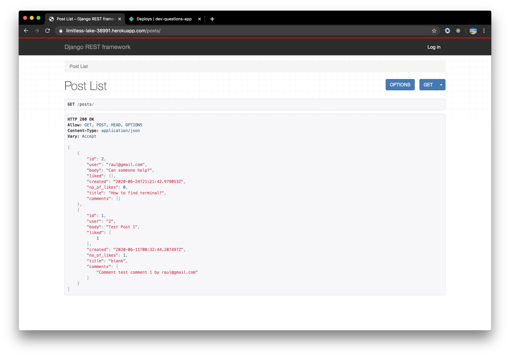
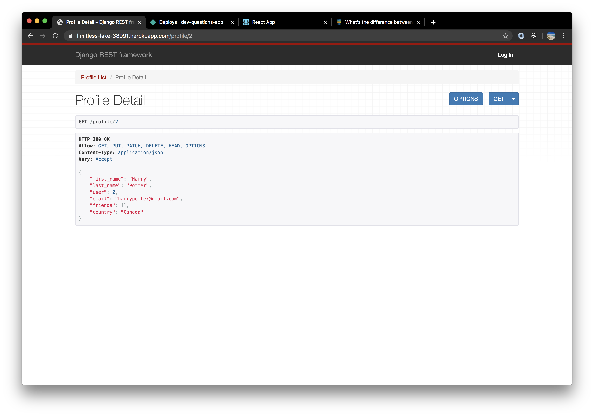
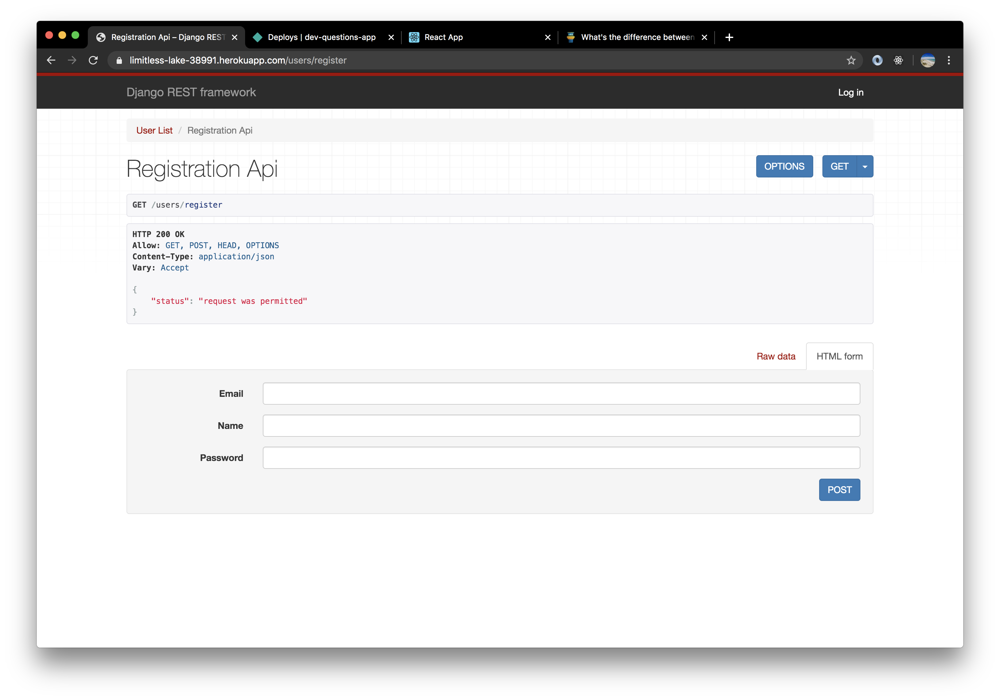

# Dev Backend

## Project Deployment
* frontend - https://dev-questions-app.netlify.app/  
* backend - https://limitless-lake-38991.herokuapp.com/posts/

## Description
This backend has routes of a social network, a user can get friends,likes, posts and auth

## Technologies Used
* Python
* Django
* PostgresSQL
* Simple Jwt Auth

## Examples

